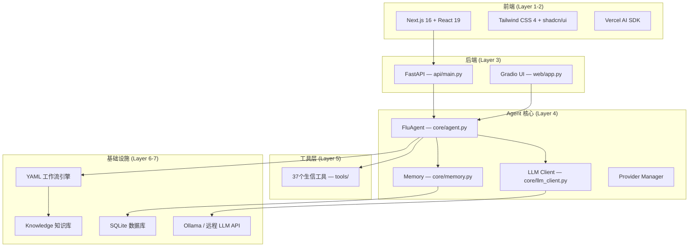

# FluAgent 仓库调研总结

> **调研日期**: 2026-04-06  
> **仓库路径**: `/home/bgi-chao/lihuyang/flu_agent`  
> **当前版本**: v3.0.0

---

## 1. 项目概述

FluAgent 是一个面向**流感病毒生物信息学分析**的 AI Agent 应用，基于 LLM（大语言模型）驱动，通过 Function Calling 机制自动调用 37 个生物信息学命令行工具完成分析任务。

### 核心能力

| 能力 | 描述 |
|------|------|
| 🧬 序列分析 | seqkit 统计/过滤/搜索/排序 |
| 🔬 质量控制 | fastp / fastqc / multiqc / cutadapt |
| 🧩 序列组装 | SPAdes / MEGAHIT |
| 🎯 序列比对 | minimap2 / samtools / BLASTn / DIAMOND |
| 🌳 进化分析 | MAFFT / trimAl / IQ-TREE / CodeML |
| 🏷️ 物种分类 | Kraken2 |
| 🔍 信息检索 | Web 搜索 / PubMed / VITALdb |
| ⚡ 工作流自动化 | YAML 工作流引擎 + Nextflow 模板 |

---

## 2. 技术栈



### 技术选型详情

| 层级 | 技术 | 用途 |
|------|------|------|
| **前端** | Next.js 16 + React 19 + Tailwind 4 | 现代 Web 界面 |
| **BFF** | Next.js API Routes | 前端与后端之间的网关 |
| **后端 API** | FastAPI (Python) | RESTful + SSE 流式接口 |
| **旧版 UI** | Gradio | 快速原型 Web 界面（保留） |
| **Agent 核心** | 纯 Python + OpenAI FC 协议 | LLM 驱动的工具调用循环 |
| **LLM 引擎** | Ollama（本地）/ 心流 / 硅基流动 | 多 Provider 自动切换 |
| **数据库** | SQLite | 对话历史 + 用户会话持久化 |
| **工作流** | YAML 引擎 + Nextflow 模板 | 预设分析流水线 |
| **认证** | JWT | 多用户身份验证 |
| **容器化** | Docker（可选） | 工具执行隔离沙箱 |

---

## 3. 目录结构

```
flu_agent/
├── run.py                  # 🚀 统一入口 (CLI / Web / API 三模式)
├── agent.py                # Agent 工厂方法入口
├── manage.py               # 管理脚本 (check-tools/check-llm/init-db/sessions/clean-cache)
├── config.py               # 旧配置兼容层
├── config_loader.py        # YAML 配置加载器 (dataclass 建模)
├── config.yaml             # 主配置文件
├── config.yaml.example     # 配置示例文件
├── api_providers.yaml      # LLM Provider 配置
├── requirements.txt        # Python 依赖
├── environment.yml         # Conda 环境配置
├── push_github.sh          # Git 推送脚本
├── run_ngrok.sh            # ngrok 公网暴露脚本
├── README.md               # 项目说明文档
├── CHANGELOG.md            # 更新日志
├── .gitignore              # Git 忽略规则
├── bioagent_architecture.html  # 架构参考图 (HTML 可视化)
│
├── core/                   # 🧠 Agent 核心模块
│   ├── __init__.py
│   ├── agent.py            # FluAgent 主控 (FC循环 / Ask-Plan-Craft)
│   ├── llm_client.py       # 统一 LLM 调用客户端 (Streaming + 重试)
│   ├── memory.py           # SQLite 对话历史 / 用户画像 / 工具统计
│   ├── prompts.py          # 系统提示词模板 (三角色)
│   ├── provider_manager.py # 多 LLM Provider 管理 (自动检测 + 选择)
│   ├── tools_manager.py    # 工具注册与管理
│   ├── evaluator.py        # 结果评估 / 校准弃权机制
│   ├── executor.py         # 命令执行器
│   ├── docker_executor.py  # Docker 容器化执行器 (V2)
│   ├── session_manager.py  # 多用户会话隔离 (V2)
│   ├── task_queue.py       # 异步任务队列 Celery+Redis (V3)
│   ├── reasoning.py        # 推理模块
│   ├── planner.py          # 规划模块
│   ├── ask_agent.py        # Ask Agent (需求解析)
│   ├── plan_agent.py       # Plan Agent (路径规划)
│   ├── craft_agent.py      # Craft Agent (任务执行)
│   └── changelog.py        # 更新日志管理
│
├── api/                    # 🌐 FastAPI 后端
│   └── main.py             # API 服务 (JWT认证/Chat/Upload/Tasks/Models)
│
├── web/                    # 🖥️ Gradio 旧版 Web UI
│   ├── __init__.py
│   ├── app.py              # Gradio 界面 (保留兼容)
│   └── components.py       # Gradio 组件
│
├── frontend/               # ⚛️ Next.js 前端
│   ├── package.json        # 依赖 (next 16 / react 19 / tailwind 4 / shadcn)
│   ├── src/
│   │   ├── app/
│   │   │   ├── layout.tsx  # 根布局
│   │   │   ├── page.tsx    # 首页
│   │   │   ├── globals.css # 全局样式
│   │   │   └── app/        # /app 路由
│   │   │       ├── layout.tsx
│   │   │       ├── page.tsx         # 对话列表页
│   │   │       └── [conversationId]/ # 动态对话页
│   │   ├── components/
│   │   │   ├── chat-panel.tsx       # 聊天面板 (核心组件)
│   │   │   ├── conversation-list.tsx # 左侧对话历史列表
│   │   │   ├── sidebar.tsx          # 侧边栏 (模型/工具/上传)
│   │   │   ├── auth-provider.tsx    # JWT 认证 Provider
│   │   │   ├── file-context.tsx     # 文件上下文管理
│   │   │   └── ui/                  # shadcn/ui 组件
│   │   └── lib/
│   │       ├── api.ts      # 后端 API 调用
│   │       ├── auth.ts     # 认证工具函数
│   │       └── utils.ts    # 通用工具函数
│   └── ...配置文件
│
├── tools/                  # 🔧 生信工具封装 (37个工具)
│   ├── __init__.py         # ToolRegistry 注册中心
│   ├── base.py             # ToolBase 基类
│   ├── utils.py            # 工具通用函数
│   ├── seqkit_tool.py      # SeqKit 序列处理 (5个工具)
│   ├── qc_tool.py          # 质控工具 (fastp/fastqc/multiqc/cutadapt)
│   ├── assembly_tool.py    # 组装工具 (SPAdes/MEGAHIT)
│   ├── alignment_tool.py   # 比对工具 (minimap2/samtools/BLASTn/DIAMOND)
│   ├── taxonomy_tool.py    # 分类工具 (Kraken2)
│   ├── evolution_tool.py   # 进化分析 (MAFFT/trimAl/IQ-TREE/CodeML)
│   ├── search_tool.py      # Web 搜索工具
│   ├── web_fetch_tool.py   # 网页抓取工具
│   ├── pubmed_tool.py      # PubMed 文献搜索
│   ├── knowledge_tool.py   # 知识库检索
│   ├── text_tool.py        # 文本处理工具
│   ├── viz_tool.py         # 可视化工具 (Circos等)
│   ├── other_tool.py       # 其他工具 (Swarm/HHblits等)
│   └── vitaldb_updater.py  # VITALdb 知识库更新
│
├── workflow/               # ⚡ 工作流引擎
│   ├── __init__.py
│   ├── engine.py           # WorkflowEngine YAML工作流执行器
│   ├── runner_tool.py      # 工作流运行工具 (FC调用入口)
│   ├── virus_analysis.yaml # 病毒全流程分析工作流
│   ├── quality_check.yaml  # 质控报告工作流
│   ├── phylogenetic_analysis.yaml  # 系统发育分析工作流
│   └── templates/          # Nextflow 模板 (V2)
│       ├── insaflu_assembly.nf
│       ├── flu_mutation_analysis.nf
│       ├── flu_phylogeny.nf
│       └── modules/        # Nextflow 子模块
│
├── knowledge/              # 📚 领域知识库
│   ├── influenza_basics.md      # 流感基础知识
│   ├── seqkit_guide.md          # SeqKit 使用指南
│   ├── workflow_guide.md        # 工作流扩展指南
│   ├── tool_usage_patterns.md   # 工具使用模式
│   ├── error_troubleshooting.md # 错误排查指南
│   ├── population_genomics.md   # 群体基因组学
│   └── vitaldb/                 # VITALdb 工具知识库
│       ├── README.md
│       └── 01~09_*.md           # 分类知识文档
│
├── data/                   # 💾 数据目录
│   ├── sessions/           # SQLite 数据库
│   │   ├── conversations.db # 对话记录数据库 ← 新功能
│   │   ├── fluagent.db     # Agent 会话数据库
│   │   └── test.db         # 测试数据库
│   ├── uploads/            # 用户上传文件 (按用户/会话隔离)
│   └── test_fasta.fa       # 测试用 FASTA 文件
│
├── example/                # 📝 示例数据
│   ├── README.md
│   ├── sample.fastq        # 示例 FASTQ 文件
│   └── sample_sequences.fasta  # 示例 FASTA 文件
│
└── reports/                # 📊 分析报告输出目录
    └── analysis_*.md       # 历史分析报告
```

---

## 4. 核心模块详解

### 4.1 Agent 核心 (`core/`)

**主控逻辑 — `core/agent.py`** (30KB)：
- **FC 循环**: 接收用户输入 → LLM 生成工具调用 → 执行工具 → 结果回填 → 循环直到任务完成
- **三角色模式 (Ask-Plan-Craft)**:
  - `AskAgent`: 多轮对话锁定用户意图
  - `PlanAgent`: 动态规划工具调用路径
  - `CraftAgent`: 执行计划并监控结果
- **校准弃权**: 结果可靠性评估，不确定时建议专家介入

**对话记忆 — `core/memory.py`** (17KB)：
- SQLite 存储对话历史
- 用户画像追踪
- 工具调用统计

### 4.2 FastAPI 后端 (`api/main.py`)

| 接口 | 方法 | 功能 |
|------|------|------|
| `/api/health` | GET | 健康检查 |
| `/api/auth/register` | POST | 用户注册 |
| `/api/auth/login` | POST | 用户登录 (返回 JWT) |
| `/api/chat` | POST | 流式聊天 (SSE) |
| `/api/conversations` | GET/POST | 对话 CRUD |
| `/api/conversations/{id}/messages` | GET | 获取对话消息 |
| `/api/models` | GET | 可用模型列表 |
| `/api/tools` | GET | 工具列表 |
| `/api/upload` | POST | 文件上传 |
| `/api/tasks/submit` | POST | 提交异步任务 |
| `/api/tasks/{id}` | GET | 查询任务状态 |

### 4.3 前端 (`frontend/`)

基于 **Next.js 16 + React 19 + Tailwind CSS 4** 构建的现代 Web 界面：
- **对话管理**: Gemini 风格的左侧对话历史列表 + 右侧聊天面板
- **流式渲染**: Vercel AI SDK `useChat` 实现逐字流式输出
- **JWT 认证**: 注册/登录/Token 管理
- **文件上传**: 支持 FASTA/FASTQ 生物序列文件
- **动态路由**: `/app/[conversationId]` 多对话切换

### 4.4 SQLite 对话管理 (新功能)

> [!IMPORTANT]
> 这是仓库新增的核心功能，使用 SQLite 管理用户对话记录。

**数据库文件**:
- `data/sessions/conversations.db` — 对话记录数据库
- `data/sessions/fluagent.db` — Agent 会话数据库

**功能特性**:
1. **对话持久化**: 所有对话消息存储在 SQLite 中，应用重启后可恢复
2. **对话列表管理**: 创建/删除/重命名对话
3. **消息历史**: 按对话分组存储 user/assistant 消息
4. **多用户隔离**: 通过 JWT 用户 ID 实现对话隔离
5. **前端同步**: Next.js `conversation-list.tsx` 组件实时展示对话列表

**相关文件**:
- [memory.py](file:///home/bgi-chao/lihuyang/flu_agent/core/memory.py) — SQLite 数据层
- [api/main.py](file:///home/bgi-chao/lihuyang/flu_agent/api/main.py) — 对话 REST API
- [conversation-list.tsx](file:///home/bgi-chao/lihuyang/flu_agent/frontend/src/components/conversation-list.tsx) — 前端对话列表
- [chat-panel.tsx](file:///home/bgi-chao/lihuyang/flu_agent/frontend/src/components/chat-panel.tsx) — 聊天面板

---

## 5. 启动方式

```bash
# CLI 模式 (命令行 REPL)
python run.py --mode cli

# Web 模式 (Gradio 旧版 UI)
python run.py --mode web --port 7861

# API 模式 (FastAPI 后端，配合 Next.js 前端)
python run.py --mode api --port 8000

# Next.js 前端
cd frontend && npm run dev
```

---


## 6. 架构总结

FluAgent 采用 **7 层分层架构**，从上到下为：

1. **Frontend** — Next.js + React + Tailwind (新开发)
2. **BFF** — Next.js API Routes (新开发)
3. **Backend** — FastAPI (替代 Gradio)
4. **Agent Core** — FluAgent 主控 + Ask-Plan-Craft 三角色
5. **Tools** — 37 个生信工具封装
6. **Workflow + Knowledge** — YAML 工作流引擎 + 领域知识库
7. **External Services** — Ollama / 远程 LLM / SQLite / 文件系统

> [!NOTE]
> 项目处于从 Gradio 单体架构向 Next.js + FastAPI 分离架构的迁移过程中。`web/app.py`（Gradio）仍然保留作为兼容选项，`api/main.py`（FastAPI）是新的主力后端。
